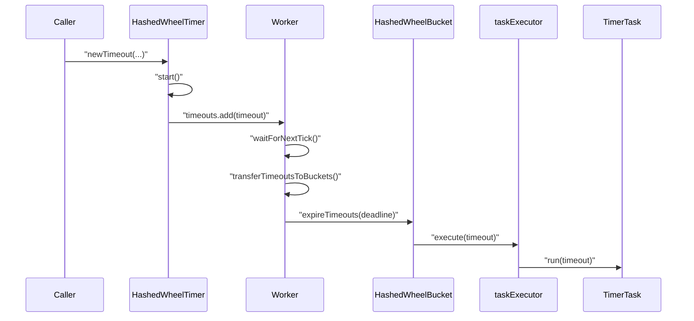
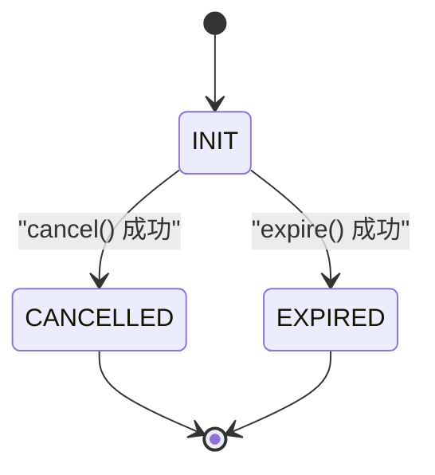
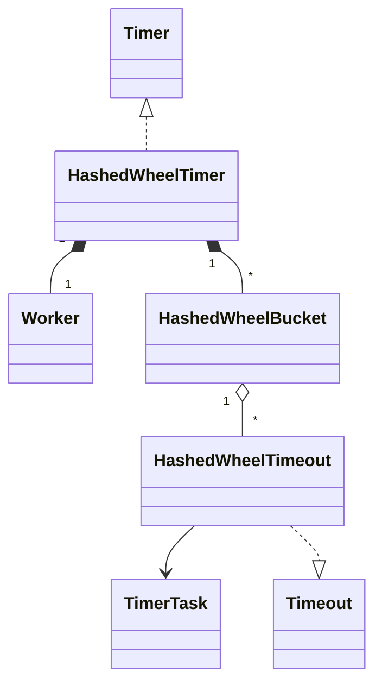

# HashedWheelTimer 源码解析

## 0 文章目标与阅读方式
本文面向有 Java 基础但不熟悉 Netty 的读者，目标是从属性到方法、从简单逻辑到复杂逻辑、从依赖关系少到依赖关系多、从局部到整体，循序渐进解析 `HashedWheelTimer` 的实现细节。全文所有属性与方法都会覆盖，并在代码块中补充中文注释。

## 1 背景与适用场景
`HashedWheelTimer` 是 Netty 提供的近似定时器实现，主要用于 I/O 超时等场景。它强调吞吐与可扩展性，而不是严格的定时精度。通过将定时任务映射到时间轮槽位，它把大量定时任务的调度成本控制在较低水平。

与精确定时器相比，`HashedWheelTimer` 允许任务延迟在一个 tick 的粒度内波动。对于网络超时这一类 "允许近似" 的问题，这种设计更合适。

## 2 基础接口速览
在进入 `HashedWheelTimer` 之前，先看 3 个基础接口，它们定义了定时器的外部契约与交互方式。

```java
public interface Timer {
    // 提交一次性任务, 在指定延迟后触发
    Timeout newTimeout(TimerTask task, long delay, TimeUnit unit);

    // 停止定时器, 返回未执行的任务集合
    Set<Timeout> stop();
}
```

```java
public interface TimerTask {
    // 到期时执行, 参数为对应的 Timeout
    void run(Timeout timeout) throws Exception;
}
```

```java
public interface Timeout {
    // 返回创建它的 Timer
    Timer timer();

    // 返回关联的 TimerTask
    TimerTask task();

    // 是否已过期
    boolean isExpired();

    // 是否已取消
    boolean isCancelled();

    // 取消任务, 成功返回 true
    boolean cancel();
}
```

核心关系可以用一句话概括：`Timer` 创建 `Timeout`，`Timeout` 关联 `TimerTask`，到期后触发 `TimerTask.run`。

## 3 关键数据结构总览
`HashedWheelTimer` 的关键数据结构如下。

- 时间轮 `wheel`，数组长度为 2 的幂次，槽位里放 `HashedWheelBucket`
- `HashedWheelBucket` 内部是双向链表，节点为 `HashedWheelTimeout`
- 两个 MPSC 队列
  - `timeouts` 用于新提交任务
  - `cancelledTimeouts` 用于取消任务
- `Worker` 线程推进时间轮，使用 `startTime` 作为统一时间基准

## 4 属性分类与详解
### 4.1 HashedWheelTimer 属性
#### 配置相关属性
```java
private static final int INSTANCE_COUNT_LIMIT = 64; // 实例上限, 超过会触发告警
private static final long MILLISECOND_NANOS = TimeUnit.MILLISECONDS.toNanos(1); // 1 毫秒对应的纳秒值
private final long tickDuration; // 每个 tick 的纳秒长度
private final HashedWheelBucket[] wheel; // 时间轮数组, 长度为 2 的幂次
private final int mask; // 取模掩码, 等于 wheel 长度减 1
private final long maxPendingTimeouts; // 最大挂起任务数量, 小于等于 0 表示不限制
private final Executor taskExecutor; // 任务执行器, 由调用方负责关闭
```

这些属性决定了定时器的粒度与容量上限。`mask` 与 `wheel` 强绑定，用于快速定位槽位。

#### 核心属性
```java
public static final int WORKER_STATE_INIT = 0; // Worker 初始状态
public static final int WORKER_STATE_STARTED = 1; // Worker 已启动状态
public static final int WORKER_STATE_SHUTDOWN = 2; // Worker 已关闭状态
private volatile int workerState; // 0 - 初始化, 1 - 已启动, 2 - 已关闭

private final Worker worker = new Worker(); // 负责推进时间轮的工作逻辑
private final Thread workerThread; // 执行 Worker 的后台线程

private final CountDownLatch startTimeInitialized = new CountDownLatch(1); // 等待 startTime 初始化
private final Queue<HashedWheelTimeout> timeouts = PlatformDependent.newMpscQueue(); // 新任务队列, 多生产者单消费者
private final Queue<HashedWheelTimeout> cancelledTimeouts = PlatformDependent.newMpscQueue(); // 取消队列, 多生产者单消费者
private final AtomicLong pendingTimeouts = new AtomicLong(0); // 挂起任务计数

private volatile long startTime; // 时间基准, 使用 System nanoTime 的起点
```

这些属性支撑核心流程，`workerThread` 驱动时间轮前进，`timeouts` 与 `cancelledTimeouts` 将并发请求转化为单线程处理。

#### 关联属性
```java
static final InternalLogger logger = InternalLoggerFactory.getInstance(HashedWheelTimer.class); // 日志工具, 输出告警
private static final AtomicInteger INSTANCE_COUNTER = new AtomicInteger(); // 统计实例数量
private static final AtomicBoolean WARNED_TOO_MANY_INSTANCES = new AtomicBoolean(); // 防止重复告警
private static final ResourceLeakDetector<HashedWheelTimer> leakDetector =
        ResourceLeakDetectorFactory.instance().newResourceLeakDetector(HashedWheelTimer.class, 1); // 泄漏检测器
private static final AtomicIntegerFieldUpdater<HashedWheelTimer> WORKER_STATE_UPDATER =
        AtomicIntegerFieldUpdater.newUpdater(HashedWheelTimer.class, "workerState"); // 原子更新 workerState

private final ResourceLeakTracker<HashedWheelTimer> leak; // 泄漏跟踪句柄
```

这些属性帮助与外部组件协作，例如日志系统、泄漏检测系统，以及原子更新工具。

### 4.2 Worker 属性
`Worker` 是内部线程逻辑的载体，属性非常少，但都属于核心流程。

```java
private final Set<Timeout> unprocessedTimeouts = new HashSet<Timeout>(); // stop 后仍未处理的 Timeout 集合
private long tick; // 当前 tick 序号
```

### 4.3 HashedWheelTimeout 属性
#### 关联属性
```java
private final HashedWheelTimer timer; // 关联的定时器实例
private final TimerTask task; // 关联的任务逻辑
```

#### 核心属性
```java
private final long deadline; // 任务截止时间, 基于 startTime 的相对纳秒值
private volatile int state = ST_INIT; // 当前状态
long remainingRounds; // 剩余轮数, 每轮减少一次

HashedWheelTimeout next; // 双向链表后继
HashedWheelTimeout prev; // 双向链表前驱
HashedWheelBucket bucket; // 所在 bucket
```

#### 关联与工具属性
```java
private static final int ST_INIT = 0; // 初始状态
private static final int ST_CANCELLED = 1; // 已取消状态
private static final int ST_EXPIRED = 2; // 已过期状态
private static final AtomicIntegerFieldUpdater<HashedWheelTimeout> STATE_UPDATER =
        AtomicIntegerFieldUpdater.newUpdater(HashedWheelTimeout.class, "state"); // 原子更新 state
```

### 4.4 HashedWheelBucket 属性
```java
private HashedWheelTimeout head; // 链表头
private HashedWheelTimeout tail; // 链表尾
```

## 5 方法分类总览
### 5.1 HashedWheelTimer 方法分类
- 工具方法
  - `createWheel`
  - `pendingTimeouts`
  - `reportTooManyInstances`
  - `finalize`
- 初始化方法
  - 所有构造方法
  - `start`
- 数据结构更新方法
  - `newTimeout`
  - `stop`
- 核心流程方法
  - `start`
  - `newTimeout`
  - `stop`
  - `Worker.run`

### 5.2 Worker 方法分类
- 工具方法
  - `unprocessedTimeouts`
- 数据结构更新方法
  - `transferTimeoutsToBuckets`
  - `processCancelledTasks`
- 核心流程方法
  - `run`
  - `waitForNextTick`

### 5.3 HashedWheelTimeout 方法分类
- 初始化方法
  - `HashedWheelTimeout(...)`
- 工具方法
  - `timer`
  - `task`
  - `compareAndSetState`
  - `state`
  - `isCancelled`
  - `isExpired`
  - `toString`
- 数据结构更新方法
  - `cancel`
  - `remove`
- 核心流程方法
  - `expire`
  - `run`

### 5.4 HashedWheelBucket 方法分类
- 数据结构更新方法
  - `addTimeout`
  - `remove`
  - `pollTimeout`
  - `clearTimeouts`
- 核心流程方法
  - `expireTimeouts`

## 6 方法逐个深度解析
### 6.1 HashedWheelTimer 构造方法族
#### 6.1.1 便捷构造方法
这些构造方法只负责参数补齐与调用链转发，逻辑简单，但决定了默认配置。

```java
public HashedWheelTimer() {
    // 使用默认 ThreadFactory
    this(Executors.defaultThreadFactory());
}

public HashedWheelTimer(long tickDuration, TimeUnit unit) {
    // 指定 tickDuration 与 TimeUnit
    this(Executors.defaultThreadFactory(), tickDuration, unit);
}

public HashedWheelTimer(long tickDuration, TimeUnit unit, int ticksPerWheel) {
    // 指定 tickDuration 与 ticksPerWheel
    this(Executors.defaultThreadFactory(), tickDuration, unit, ticksPerWheel);
}

public HashedWheelTimer(ThreadFactory threadFactory) {
    // 只指定 ThreadFactory, tickDuration 使用默认值
    this(threadFactory, 100, TimeUnit.MILLISECONDS);
}

public HashedWheelTimer(ThreadFactory threadFactory, long tickDuration, TimeUnit unit) {
    // 指定 ThreadFactory 与 tickDuration, ticksPerWheel 使用默认值
    this(threadFactory, tickDuration, unit, 512);
}

public HashedWheelTimer(ThreadFactory threadFactory,
                        long tickDuration, TimeUnit unit, int ticksPerWheel) {
    // 指定 ThreadFactory 与 ticksPerWheel, leakDetection 使用默认值
    this(threadFactory, tickDuration, unit, ticksPerWheel, true);
}

public HashedWheelTimer(ThreadFactory threadFactory,
                        long tickDuration, TimeUnit unit, int ticksPerWheel, boolean leakDetection) {
    // 指定 leakDetection, maxPendingTimeouts 使用默认值
    this(threadFactory, tickDuration, unit, ticksPerWheel, leakDetection, -1);
}

public HashedWheelTimer(ThreadFactory threadFactory,
                        long tickDuration, TimeUnit unit, int ticksPerWheel,
                        boolean leakDetection, long maxPendingTimeouts) {
    // 使用默认 taskExecutor
    this(threadFactory, tickDuration, unit, ticksPerWheel, leakDetection, maxPendingTimeouts,
            ImmediateExecutor.INSTANCE);
}
```

关键点：一条清晰的构造链让默认配置集中在最终构造方法中，减少重复逻辑。

#### 6.1.2 完整构造方法
这是唯一真正 "干活" 的构造方法，完成参数校验、时间轮构建、线程与泄漏检测初始化。

```java
public HashedWheelTimer(ThreadFactory threadFactory,
                        long tickDuration, TimeUnit unit, int ticksPerWheel,
                        boolean leakDetection, long maxPendingTimeouts, Executor taskExecutor) {

    // 参数校验
    checkNotNull(threadFactory, "threadFactory");
    checkNotNull(unit, "unit");
    checkPositive(tickDuration, "tickDuration");
    checkPositive(ticksPerWheel, "ticksPerWheel");
    this.taskExecutor = checkNotNull(taskExecutor, "taskExecutor");

    // 创建 wheel, 长度会被规范化为 2 的幂次
    wheel = createWheel(ticksPerWheel);
    mask = wheel.length - 1;

    // tickDuration 转换为纳秒
    long duration = unit.toNanos(tickDuration);

    // 防止溢出
    if (duration >= Long.MAX_VALUE / wheel.length) {
        throw new IllegalArgumentException("tickDuration overflow");
    }

    // 低于 1 毫秒时统一为 1 毫秒
    if (duration < MILLISECOND_NANOS) {
        logger.warn("tickDuration too small, use 1ms");
        this.tickDuration = MILLISECOND_NANOS;
    } else {
        this.tickDuration = duration;
    }

    // 创建并保存 Worker 线程
    workerThread = threadFactory.newThread(worker);

    // 初始化泄漏跟踪
    leak = leakDetection || !workerThread.isDaemon() ? leakDetector.track(this) : null;

    // 保存最大挂起任务数量
    this.maxPendingTimeouts = maxPendingTimeouts;

    // 实例计数与过量告警
    if (INSTANCE_COUNTER.incrementAndGet() > INSTANCE_COUNT_LIMIT &&
        WARNED_TOO_MANY_INSTANCES.compareAndSet(false, true)) {
        reportTooManyInstances();
    }
}
```

设计思路与关键点：
- `createWheel` 会把 `ticksPerWheel` 规范化为 2 的幂次，保证 `mask` 可用于快速取模
- `tickDuration` 以纳秒保存，同时避免溢出
- `taskExecutor` 默认使用 `ImmediateExecutor`，让任务在 `Worker` 线程直接执行
- 实例计数告警用于提醒 "不能创建过多定时器" 的最佳实践

### 6.2 createWheel
这是一个纯工具方法，用来创建时间轮数组并初始化每个槽位。

```java
private static HashedWheelBucket[] createWheel(int ticksPerWheel) {
    // 规范化为 2 的幂次
    ticksPerWheel = MathUtil.findNextPositivePowerOfTwo(ticksPerWheel);

    // 创建 bucket 数组并逐一初始化
    HashedWheelBucket[] wheel = new HashedWheelBucket[ticksPerWheel];
    for (int i = 0; i < wheel.length; i++) {
        wheel[i] = new HashedWheelBucket();
    }
    return wheel;
}
```

关键点：使用 2 的幂次让索引计算可以用位运算完成。

### 6.3 pendingTimeouts
这是一个简单的读取方法，用于暴露当前挂起数量。

```java
public long pendingTimeouts() {
    // 直接读取原子计数
    return pendingTimeouts.get();
}
```

### 6.4 reportTooManyInstances
用于打印实例过多的告警，避免定时器被滥用。

```java
private static void reportTooManyInstances() {
    // 仅在日志级别允许时输出
    if (logger.isErrorEnabled()) {
        String resourceType = simpleClassName(HashedWheelTimer.class);
        logger.error("Too many " + resourceType + " instances");
    }
}
```

### 6.5 start
`start` 是核心流程入口之一，负责启动 `Worker` 线程，并等待 `startTime` 初始化完成。

```java
public void start() {
    switch (WORKER_STATE_UPDATER.get(this)) {
        case WORKER_STATE_INIT:
            // 使用 CAS 保证只启动一次
            if (WORKER_STATE_UPDATER.compareAndSet(this, WORKER_STATE_INIT, WORKER_STATE_STARTED)) {
                workerThread.start();
            }
            break;
        case WORKER_STATE_STARTED:
            // 已启动则直接返回
            break;
        case WORKER_STATE_SHUTDOWN:
            // 已停止不允许重启
            throw new IllegalStateException("cannot be started once stopped");
        default:
            throw new Error("Invalid WorkerState");
    }

    // 等待 startTime 被 Worker 初始化
    while (startTime == 0) {
        try {
            startTimeInitialized.await();
        } catch (InterruptedException ignore) {
            // 被打断也继续等待
        }
    }
}
```

关键点：
- `startTime` 由 `Worker` 线程初始化，确保时间基准统一
- 使用 `CountDownLatch` 解决 "线程启动时机" 的并发问题

### 6.6 newTimeout
`newTimeout` 负责创建任务并放入 `timeouts` 队列，它只做入队，真正的槽位分配发生在 `Worker` 线程。

```java
public Timeout newTimeout(TimerTask task, long delay, TimeUnit unit) {
    // 参数校验
    checkNotNull(task, "task");
    checkNotNull(unit, "unit");

    // 增加挂起计数
    long pendingTimeoutsCount = pendingTimeouts.incrementAndGet();

    // 超过最大挂起数量时拒绝
    if (maxPendingTimeouts > 0 && pendingTimeoutsCount > maxPendingTimeouts) {
        pendingTimeouts.decrementAndGet();
        throw new RejectedExecutionException("too many pending timeouts");
    }

    // 懒启动 Worker
    start();

    // 计算相对 startTime 的截止时间
    long deadline = System.nanoTime() + unit.toNanos(delay) - startTime;

    // 防止溢出
    if (delay > 0 && deadline < 0) {
        deadline = Long.MAX_VALUE;
    }

    // 封装为 HashedWheelTimeout 并入队
    HashedWheelTimeout timeout = new HashedWheelTimeout(this, task, deadline);
    timeouts.add(timeout);
    return timeout;
}
```

关键点：
- `newTimeout` 只负责入队，不直接放入 `wheel`
- `deadline` 使用相对时间，避免 `System.nanoTime` 与真实时间的差异
- 挂起数量通过 `pendingTimeouts` 统一计数

### 6.7 stop
`stop` 负责关闭线程并回收未处理任务，同时确保资源统计正确。

```java
public Set<Timeout> stop() {
    // 禁止在 Worker 线程内调用
    if (Thread.currentThread() == workerThread) {
        throw new IllegalStateException("stop from worker thread");
    }

    // 尝试从 STARTED 切换到 SHUTDOWN
    if (!WORKER_STATE_UPDATER.compareAndSet(this, WORKER_STATE_STARTED, WORKER_STATE_SHUTDOWN)) {
        // INIT 或已 SHUTDOWN, INIT 时直接处理计数与泄漏
        if (WORKER_STATE_UPDATER.getAndSet(this, WORKER_STATE_SHUTDOWN) != WORKER_STATE_SHUTDOWN) {
            INSTANCE_COUNTER.decrementAndGet();
            if (leak != null) {
                leak.close(this);
            }
        }
        return Collections.emptySet();
    }

    try {
        boolean interrupted = false;
        while (workerThread.isAlive()) {
            workerThread.interrupt();
            try {
                workerThread.join(100);
            } catch (InterruptedException ignored) {
                interrupted = true;
            }
        }
        if (interrupted) {
            Thread.currentThread().interrupt();
        }
    } finally {
        INSTANCE_COUNTER.decrementAndGet();
        if (leak != null) {
            leak.close(this);
        }
    }

    // 收集未处理任务并取消
    Set<Timeout> unprocessed = worker.unprocessedTimeouts();
    Set<Timeout> cancelled = new HashSet<Timeout>(unprocessed.size());
    for (Timeout timeout : unprocessed) {
        if (timeout.cancel()) {
            cancelled.add(timeout);
        }
    }
    return cancelled;
}
```

关键点：
- `stop` 会返回 "未执行但已取消" 的 `Timeout` 集合
- 通过 `interrupt + join` 确保 `Worker` 线程停止
- 资源计数与泄漏跟踪始终成对处理

### 6.8 finalize
该方法用于兜底释放实例计数，确保 GC 阶段不留下脏状态。

```java
@Override
protected void finalize() throws Throwable {
    try {
        super.finalize();
    } finally {
        // 如果未正常 stop, 这里补充计数递减
        if (WORKER_STATE_UPDATER.getAndSet(this, WORKER_STATE_SHUTDOWN) != WORKER_STATE_SHUTDOWN) {
            INSTANCE_COUNTER.decrementAndGet();
        }
    }
}
```

关键点：`finalize` 只是兜底策略，正常使用仍应显式调用 `stop`。

## 7 Worker 方法解析
### 7.1 unprocessedTimeouts
```java
public Set<Timeout> unprocessedTimeouts() {
    // 返回只读集合
    return Collections.unmodifiableSet(unprocessedTimeouts);
}
```

作用：只读暴露未处理任务集合，避免调用方修改内部数据结构。

### 7.2 processCancelledTasks
```java
private void processCancelledTasks() {
    for (;;) {
        HashedWheelTimeout timeout = cancelledTimeouts.poll();
        if (timeout == null) {
            // 取消队列已清空
            break;
        }
        try {
            timeout.remove();
        } catch (Throwable t) {
            if (logger.isWarnEnabled()) {
                logger.warn("exception while processing cancel", t);
            }
        }
    }
}
```

关键点：取消任务只是入队，真正移除由 `Worker` 线程统一处理。

### 7.3 transferTimeoutsToBuckets
```java
private void transferTimeoutsToBuckets() {
    // 单次最多转移 100000 个任务, 避免 Worker 长时间被占用
    for (int i = 0; i < 100000; i++) {
        HashedWheelTimeout timeout = timeouts.poll();
        if (timeout == null) {
            // 没有新任务
            break;
        }
        if (timeout.state() == HashedWheelTimeout.ST_CANCELLED) {
            // 已取消的任务直接跳过
            continue;
        }

        long calculated = timeout.deadline / tickDuration;
        timeout.remainingRounds = (calculated - tick) / wheel.length;

        // 保证不会调度到过去
        final long ticks = Math.max(calculated, tick);
        int stopIndex = (int) (ticks & mask);

        HashedWheelBucket bucket = wheel[stopIndex];
        bucket.addTimeout(timeout);
    }
}
```

关键点：
- `remainingRounds` 表示还需经过多少圈时间轮
- `stopIndex` 使用 `mask` 进行快速取模

### 7.4 waitForNextTick
这是 `Worker` 时间推进的节拍器，复杂度较高，需要逐行分析。

```java
private long waitForNextTick() {
    // 计算下一个 tick 的目标时间
    long deadline = tickDuration * (tick + 1);

    for (;;) {
        final long currentTime = System.nanoTime() - startTime;
        long sleepTimeMs = (deadline - currentTime + 999999) / 1000000;

        if (sleepTimeMs <= 0) {
            if (currentTime == Long.MIN_VALUE) {
                // 避免极端时间值导致的异常
                return -Long.MAX_VALUE;
            } else {
                return currentTime;
            }
        }

        // Windows 平台需要对 sleep 时间做 10ms 对齐
        if (PlatformDependent.isWindows()) {
            sleepTimeMs = sleepTimeMs / 10 * 10;
            if (sleepTimeMs == 0) {
                sleepTimeMs = 1;
            }
        }

        try {
            Thread.sleep(sleepTimeMs);
        } catch (InterruptedException ignored) {
            if (WORKER_STATE_UPDATER.get(HashedWheelTimer.this) == WORKER_STATE_SHUTDOWN) {
                return Long.MIN_VALUE;
            }
        }
    }
}
```

关键点：
- `deadline` 由 `tickDuration` 与 `tick` 计算，确保稳定节拍
- Windows 的 10ms 对齐是 JVM 已知问题的规避策略
- 返回 `Long.MIN_VALUE` 作为关闭信号

### 7.5 run
`run` 是 `Worker` 的主循环，负责时间推进、任务转移、过期执行与收尾处理。

```java
@Override
public void run() {
    // 初始化 startTime, 0 作为未初始化标记
    startTime = System.nanoTime();
    if (startTime == 0) {
        startTime = 1;
    }

    // 通知 start 等待线程
    startTimeInitialized.countDown();

    do {
        final long deadline = waitForNextTick();
        if (deadline > 0) {
            int idx = (int) (tick & mask);
            processCancelledTasks();
            HashedWheelBucket bucket = wheel[idx];
            transferTimeoutsToBuckets();
            bucket.expireTimeouts(deadline);
            tick++;
        }
    } while (WORKER_STATE_UPDATER.get(HashedWheelTimer.this) == WORKER_STATE_STARTED);

    // 收集未处理任务
    for (HashedWheelBucket bucket : wheel) {
        bucket.clearTimeouts(unprocessedTimeouts);
    }
    for (;;) {
        HashedWheelTimeout timeout = timeouts.poll();
        if (timeout == null) {
            break;
        }
        if (!timeout.isCancelled()) {
            unprocessedTimeouts.add(timeout);
        }
    }
    processCancelledTasks();
}
```

关键点：
- 每个 tick 的顺序是 "先处理取消，再转移新任务，再过期检查"
- `tick` 递增后形成稳定的时间推进
- 退出循环后统一收集未处理任务，供 `stop` 使用

## 8 HashedWheelTimeout 方法解析
### 8.0 构造方法
该构造方法只做字段赋值，确保 `timer`、`task` 与 `deadline` 在创建后不可变，从而简化并发语义。

```java
HashedWheelTimeout(HashedWheelTimer timer, TimerTask task, long deadline) {
    // 保存关联对象与截止时间
    this.timer = timer;
    this.task = task;
    this.deadline = deadline;
}
```

关键点：构造阶段不涉及队列或 bucket，仅负责数据装配。

### 8.1 timer 与 task
```java
@Override
public Timer timer() {
    // 返回创建该 Timeout 的定时器
    return timer;
}

@Override
public TimerTask task() {
    // 返回关联的 TimerTask
    return task;
}
```

作用：对外提供只读访问，避免调用方绕过 `Timeout` 直接修改内部状态。

### 8.2 compareAndSetState 与 state
```java
public boolean compareAndSetState(int expected, int state) {
    // 原子更新 state
    return STATE_UPDATER.compareAndSet(this, expected, state);
}

public int state() {
    // 直接读取 state
    return state;
}
```

关键点：状态更新统一通过 `STATE_UPDATER` 完成，保证并发可见性与原子性。

### 8.3 isCancelled 与 isExpired
```java
@Override
public boolean isCancelled() {
    // 判断是否为取消状态
    return state() == ST_CANCELLED;
}

@Override
public boolean isExpired() {
    // 判断是否为过期状态
    return state() == ST_EXPIRED;
}
```

作用：把内部状态映射为对外语义，调用方无需理解状态数字含义。

### 8.4 cancel
取消操作不会立即移除节点，而是进入 `cancelledTimeouts` 队列。

```java
@Override
public boolean cancel() {
    // 只允许从 INIT 进入 CANCELLED
    if (!compareAndSetState(ST_INIT, ST_CANCELLED)) {
        return false;
    }
    // 放入取消队列, 交给 Worker 统一处理
    timer.cancelledTimeouts.add(this);
    return true;
}
```

关键点：用延迟移除换取并发安全与低锁开销。

### 8.5 remove
```java
void remove() {
    HashedWheelBucket bucket = this.bucket;
    if (bucket != null) {
        bucket.remove(this);
    }
    timer.pendingTimeouts.decrementAndGet();
}
```

关键点：删除节点后一定要递减 `pendingTimeouts`，避免计数漂移。

### 8.6 expire
`expire` 是到期执行的关键方法。

```java
public void expire() {
    // 只允许从 INIT 进入 EXPIRED
    if (!compareAndSetState(ST_INIT, ST_EXPIRED)) {
        return;
    }

    try {
        remove();
        timer.taskExecutor.execute(this);
    } catch (Throwable t) {
        if (logger.isWarnEnabled()) {
            logger.warn("exception while submit TimerTask", t);
        }
    }
}
```

关键点：
- `remove` 会减少 `pendingTimeouts`
- 通过 `taskExecutor` 执行 `TimerTask`，默认是直接在 `Worker` 线程执行

### 8.7 run
```java
@Override
public void run() {
    try {
        task.run(this);
    } catch (Throwable t) {
        if (logger.isWarnEnabled()) {
            logger.warn("exception in TimerTask", t);
        }
    }
}
```

作用：包装 `TimerTask.run`，保证异常被吞掉，防止 `Worker` 线程被异常终止。

### 8.8 toString
```java
@Override
public String toString() {
    final long currentTime = System.nanoTime();
    long remaining = deadline - currentTime + timer.startTime;

    StringBuilder buf = new StringBuilder(192)
        .append(simpleClassName(this))
        .append('(')
        .append("deadline: ");

    if (remaining > 0) {
        buf.append(remaining).append(" ns later");
    } else if (remaining < 0) {
        buf.append(-remaining).append(" ns ago");
    } else {
        buf.append("now");
    }

    if (isCancelled()) {
        buf.append(", cancelled");
    }

    return buf.append(", task: ")
              .append(task())
              .append(')')
              .toString();
}
```

关键点：`remaining` 依赖 `startTime` 计算相对时间，符合时间轮的内部语义。

## 9 HashedWheelBucket 方法解析
### 9.1 addTimeout
```java
public void addTimeout(HashedWheelTimeout timeout) {
    // 只有未绑定 bucket 的节点才允许加入
    assert timeout.bucket == null;
    timeout.bucket = this;
    if (head == null) {
        head = tail = timeout;
    } else {
        tail.next = timeout;
        timeout.prev = tail;
        tail = timeout;
    }
}
```

关键点：链表尾插入是 O(1)，符合时间轮对高吞吐的要求。

### 9.2 remove
```java
public HashedWheelTimeout remove(HashedWheelTimeout timeout) {
    HashedWheelTimeout next = timeout.next;

    // 更新前驱与后继的链接
    if (timeout.prev != null) {
        timeout.prev.next = next;
    }
    if (timeout.next != null) {
        timeout.next.prev = timeout.prev;
    }

    // 处理 head 与 tail
    if (timeout == head) {
        if (timeout == tail) {
            tail = null;
            head = null;
        } else {
            head = next;
        }
    } else if (timeout == tail) {
        tail = timeout.prev;
    }

    // 断开指针, 便于 GC
    timeout.prev = null;
    timeout.next = null;
    timeout.bucket = null;
    return next;
}
```

作用：支持链表中间删除，同时维护 head 与 tail，确保结构一致。

### 9.3 pollTimeout
```java
private HashedWheelTimeout pollTimeout() {
    HashedWheelTimeout head = this.head;
    if (head == null) {
        return null;
    }
    HashedWheelTimeout next = head.next;
    if (next == null) {
        tail = this.head = null;
    } else {
        this.head = next;
        next.prev = null;
    }

    // 断开指针, 便于 GC
    head.next = null;
    head.prev = null;
    head.bucket = null;
    return head;
}
```

作用：从头部弹出节点，主要用于 stop 阶段清理与收集。

### 9.4 clearTimeouts
```java
public void clearTimeouts(Set<Timeout> set) {
    for (;;) {
        HashedWheelTimeout timeout = pollTimeout();
        if (timeout == null) {
            return;
        }
        if (timeout.isExpired() || timeout.isCancelled()) {
            continue;
        }
        set.add(timeout);
    }
}
```

关键点：只收集未过期且未取消的任务，避免重复处理。

### 9.5 expireTimeouts
这是 bucket 内部的核心过期逻辑。

```java
public void expireTimeouts(long deadline) {
    HashedWheelTimeout timeout = head;

    // 遍历链表
    while (timeout != null) {
        HashedWheelTimeout next = timeout.next;
        if (timeout.remainingRounds <= 0) {
            if (timeout.deadline <= deadline) {
                timeout.expire();
            } else {
                // deadline 超前属于异常情况
                throw new IllegalStateException("timeout deadline too late");
            }
        } else if (!timeout.isCancelled()) {
            timeout.remainingRounds--;
        }
        timeout = next;
    }
}
```

关键点：
- `remainingRounds` 控制任务跨越多个时间轮
- 到期后调用 `expire`，任务进入执行阶段

## 10 核心流程整体串联
下面用时序图把 `newTimeout` 到执行的整体流程串起来。



状态转换也可以用状态图表示。



类之间的静态关系如下。



## 11 使用案例
本章给出一个完整上下文的使用案例，展示 `HashedWheelTimer` 在真实业务中的典型用法。场景设定为 "简化版 RPC 客户端超时控制" 场景，读者可把它映射到 HTTP 调用、数据库调用或内部服务调用。

### 11.1 业务背景
客户端需要对每个请求设置超时，当请求在规定时间内返回时取消超时任务，若超时则触发补偿逻辑。为了降低成本与提高可扩展性，我们使用 `HashedWheelTimer` 作为统一的超时调度器。

### 11.2 核心代码
```java
public final class RpcTimeoutManager {
    private final HashedWheelTimer timer;
    private final ConcurrentHashMap<String, Timeout> timeouts;

    public RpcTimeoutManager() {
        this.timer = new HashedWheelTimer();
        this.timeouts = new ConcurrentHashMap<String, Timeout>();
    }

    public void onRequestStart(final String requestId, long timeoutMs) {
        Timeout timeout = timer.newTimeout(new TimerTask() {
            @Override
            public void run(Timeout timeout) {
                onRequestTimeout(requestId);
            }
        }, timeoutMs, TimeUnit.MILLISECONDS);
        timeouts.put(requestId, timeout);
    }

    public void onRequestSuccess(String requestId) {
        Timeout timeout = timeouts.remove(requestId);
        if (timeout != null) {
            timeout.cancel();
        }
    }

    public void shutdown() {
        timer.stop();
    }

    private void onRequestTimeout(String requestId) {
        timeouts.remove(requestId);
        // 这里执行超时补偿逻辑
    }
}
```

### 11.3 流程说明
- 请求开始时调用 `onRequestStart`，在时间轮中注册超时任务  
- 请求成功时调用 `onRequestSuccess`，取消定时任务并移除本地记录  
- 超时触发时执行 `onRequestTimeout`，完成补偿逻辑并清理本地状态  
- 关闭阶段调用 `shutdown`，释放定时器资源  

### 11.4 关键点
- 统一使用单个 `HashedWheelTimer`，避免多实例带来的线程与资源消耗  
- `Timeout` 需要持久化在本地结构中，以便请求成功时进行取消  
- 取消后的任务不会立即移除，而是由 `Worker` 线程在下一个 tick 统一清理  
- 若业务需要隔离执行线程，可在构造 `HashedWheelTimer` 时传入自定义 `taskExecutor`  

### 11.5 四角色共识
- 角色一 总设计者：案例覆盖创建、注册、取消、关闭，流程与源码机制一致  
- 角色二 Java 初学者：上下文完整，能够理解为什么要保存 `Timeout` 与何时取消  
- 角色三 谷歌 Java 技术专家：线程模型合理，取消与清理时序正确，资源释放明确  
- 角色四 普林斯顿大学计算机 Java 老师：示例足够贴近真实业务，读者可直接迁移到项目  

## 12 使用示例与行为验证
以下示例来自测试用例，帮助理解行为边界。

### 12.1 不会提前触发
```java
final Timer timer = new HashedWheelTimer();
final CountDownLatch barrier = new CountDownLatch(1);

// 延迟 10 秒, 3 秒内不应触发
timer.newTimeout(timeout -> barrier.countDown(), 10, TimeUnit.SECONDS);
```

要点：`HashedWheelTimer` 不会早于目标 tick 触发任务。

### 12.2 到期后会触发
```java
final Timer timer = new HashedWheelTimer();
final CountDownLatch barrier = new CountDownLatch(1);

// 延迟 2 秒, 3 秒内应触发
timer.newTimeout(timeout -> barrier.countDown(), 2, TimeUnit.SECONDS);
```

### 12.3 stop 后未处理任务会被取消
```java
final Timer timer = new HashedWheelTimer();
for (int i = 0; i < 5; i++) {
    timer.newTimeout(timeout -> { }, 5, TimeUnit.SECONDS);
}
Set<Timeout> cancelled = timer.stop();
```

要点：`stop` 会返回未执行任务的集合，并对它们执行取消。

### 12.4 maxPendingTimeouts 限制
```java
HashedWheelTimer timer = new HashedWheelTimer(Executors.defaultThreadFactory(), 100,
    TimeUnit.MILLISECONDS, 32, true, 2);

// 第 3 个提交应触发拒绝
```

要点：当挂起任务数量超过上限，会抛出 `RejectedExecutionException`。

### 12.5 Windows 休眠对齐
`waitForNextTick` 在 Windows 平台执行 10ms 对齐，这是 JVM 定时精度问题的保护手段。

## 13 多角色审阅摘要
- 角色一 总设计者：结构从属性到方法，再到流程整体，顺序合理，默认配置解释完整
- 角色二 Java 初学者：关键概念解释清晰，示例帮助理解 tick 与时间轮的含义
- 角色三 谷歌 Java 技术专家：并发语义与原子更新解释准确，风险点已提示
- 角色四 普林斯顿大学计算机 Java 老师：语言通俗，图示与分层结构有助于理解

## 14 小结与常见问题
- 为什么不是精确定时器
  - 时间轮设计强调吞吐与可扩展性，允许一个 tick 范围内的误差
- 任务为什么不直接放入 wheel
  - 避免多线程竞争，统一由 `Worker` 线程转移
- 为什么需要 `maxPendingTimeouts`
  - 防止任务数量无限增长，避免内存与调度压力
- `taskExecutor` 有什么作用
  - 控制任务执行线程，默认在 `Worker` 线程执行，也可以自定义线程池
