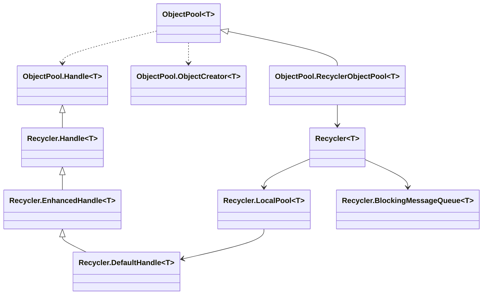
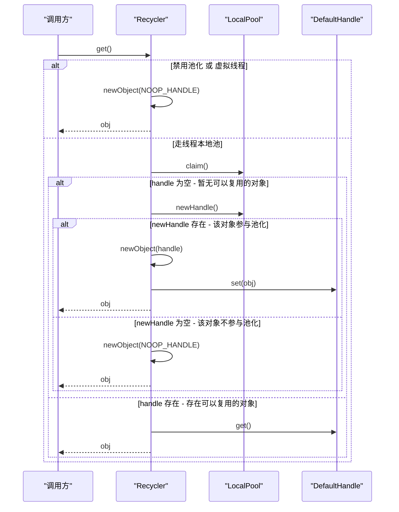
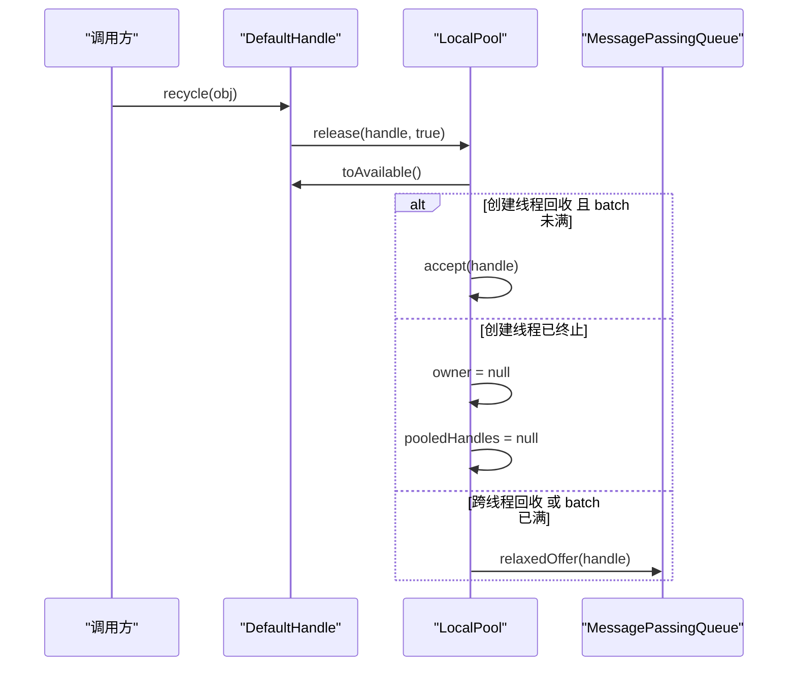

# ObjectPool 与 Recycler 源码解析

## 0 文章目标与阅读方式
本文面向有 Java 基础但不熟悉 Netty 的读者，目标是从属性到方法、从简单逻辑到复杂逻辑、从依赖关系少到依赖关系多、从局部到整体，循序渐进解析 `ObjectPool` 与 `Recycler` 的实现细节。全文所有属性与方法都会覆盖，并在代码块中补充中文注释。方法分为四类：构造方法、核心流程方法、工具方法、数据结构更新方法。属性分为三类：配置相关属性、核心属性、关联属性。

## 1 背景与使用场景
对象池的核心价值是复用对象，降低频繁创建与回收带来的分配成本。`ObjectPool` 提供轻量抽象，定义了对象获取与回收的统一接口。`Recycler` 是具体实现，基于线程本地栈与多生产者单消费者队列，兼顾性能与并发安全。

在对象池语义中，`ObjectPool` 负责对象获取，代表对象池对外入口。`ObjectCreator` 负责对象创建，返回带 `Handle` 的对象实例。`Handle` 负责对象回收，把对象归还到池。`RecyclerObjectPool` 是 `ObjectPool` 的内部实现类，内部使用 `Recycler` 作为对象池。四者形成创建、获取、回收的闭环，便于理解与扩展。

适用场景包括频繁创建的临时对象、短生命周期对象以及高吞吐路径上的对象复用。对于需要极低延迟或大量对象创建的场景，合理使用 `Recycler` 可以显著减少 GC 压力。

## 2 使用示例
本节用两个真实场景串起 ObjectPool 与 Recycler，分别覆盖高频写任务与解码上下文复用。示例仍是单文件，可直接编译运行。

- 场景 A：高频网络写任务封装
- 场景 B：协议解码上下文复用

```java
import io.netty.util.Recycler;
import io.netty.util.internal.ObjectPool;

import java.nio.charset.StandardCharsets;
import java.util.Arrays;
import java.util.List;

public final class ObjectPoolRecyclerExample {

    // 高频写任务封装, 使用 ObjectPool 复用
    private static final ObjectPool<WriteTask> WRITE_TASK_POOL =
            ObjectPool.newPool(new ObjectPool.ObjectCreator<WriteTask>() {
                @Override
                public WriteTask newObject(ObjectPool.Handle<WriteTask> handle) {
                    // 创建时注入 handle, 便于回收
                    return new WriteTask(handle);
                }
            });

    // 协议解码上下文, 使用 Recycler 复用
    private static final Recycler<DecodeContext> DECODE_CONTEXT_RECYCLER = new Recycler<DecodeContext>() {
        @Override
        protected DecodeContext newObject(Recycler.Handle<DecodeContext> handle) {
            // 创建时注入 handle, 便于回收
            return new DecodeContext(handle);
        }
    };

    public static void main(String[] args) {
        // 场景 A, 高频网络写任务
        List<String> outbound = Arrays.asList("PING", "PONG", "DATA");
        for (String msg : outbound) {
            WriteTask task = WRITE_TASK_POOL.get();
            task.init(msg, () -> System.out.println("sent: " + msg));
            task.send();
        }

        // 场景 B, 协议解码上下文复用
        List<byte[]> frames = Arrays.asList(
                "REQ login".getBytes(StandardCharsets.UTF_8),
                "REQ ping".getBytes(StandardCharsets.UTF_8),
                "REQ data".getBytes(StandardCharsets.UTF_8)
        );
        for (byte[] frame : frames) {
            DecodeContext ctx = DECODE_CONTEXT_RECYCLER.get();
            ctx.decode(frame);
            ctx.recycle();
        }
    }

    private static final class WriteTask {
        // Handle 用于回收
        private final ObjectPool.Handle<WriteTask> handle;
        private String message;
        private Runnable callback;

        private WriteTask(ObjectPool.Handle<WriteTask> handle) {
            this.handle = handle;
        }

        private void init(String message, Runnable callback) {
            // 初始化对象, 保存消息与回调
            this.message = message;
            this.callback = callback;
        }

        private void send() {
            // 模拟写入完成回调
            if (callback != null) {
                callback.run();
            }
            clear();
            handle.recycle(this);
        }

        private void clear() {
            // 释放业务字段, 避免脏数据
            message = null;
            callback = null;
        }
    }

    private static final class DecodeContext {
        // Handle 用于回收
        private final Recycler.Handle<DecodeContext> handle;
        private final StringBuilder builder = new StringBuilder();
        private byte[] temp = new byte[64];

        private DecodeContext(Recycler.Handle<DecodeContext> handle) {
            this.handle = handle;
        }

        private void decode(byte[] frame) {
            // 模拟解码过程, 复用 buffer 与 builder
            int len = Math.min(frame.length, temp.length);
            System.arraycopy(frame, 0, temp, 0, len);
            builder.append(new String(temp, 0, len, StandardCharsets.UTF_8));
            System.out.println("decode: " + builder);
        }

        private void recycle() {
            // 清理状态, 归还对象
            builder.setLength(0);
            handle.recycle(this);
        }
    }
}
```

## 3 类关系图


## 3.1 核心概念与职责
这一节把核心角色的职责明确下来，先建立心智模型，再进入源码细节。

- `ObjectPool` 负责对象获取，也代表对象池的对外入口，调用方主要关注 `get`
- `ObjectCreator` 负责对象创建，返回携带 `Handle` 的对象实例
- `Handle` 负责对象回收，对象生命周期结束时由调用方归还
- `RecyclerObjectPool` 是 `ObjectPool` 的内部实现类，内部使用 `Recycler` 作为对象池

这些职责相互解耦，创建逻辑由 `ObjectCreator` 管理，复用逻辑由 `Recycler` 管理，`ObjectPool` 只暴露简洁入口。

## 3.2 调用链概览
调用链可以分为获取与回收两条路径，先理解路径再看实现会更顺畅。

- 获取路径：调用方调用 `ObjectPool.get`，请求进入 `RecyclerObjectPool.get`，最终由 `Recycler.get` 驱动 `LocalPool`，优先从 `batch` 复用，必要时按 `ratio` 创建或退化到 `NOOP_HANDLE`
- 回收路径：对象持有 `Handle`，调用 `Handle.recycle` 进入 `LocalPool.release`，同线程优先回收到 `batch`，跨线程回收到队列

## 4 ObjectPool 解析
### 4.1 属性分类
- 配置相关属性：无
- 核心属性：`RecyclerObjectPool.recycler`
- 关联属性：无

### 4.2 方法分类
- `newPool`
- 构造方法：`ObjectPool` 构造，`RecyclerObjectPool` 构造
- `Handle.recycle`
- 核心流程方法：`get`，`RecyclerObjectPool.get`

### 4.3 属性详解
`ObjectPool` 本身没有字段，真正的状态在内部实现 `RecyclerObjectPool` 中。

```java
private static final class RecyclerObjectPool<T> extends ObjectPool<T> {
    // 核心属性: 真实对象池实现, 承担复用逻辑
    private final Recycler<T> recycler;
}
```

`recycler` 是核心属性，因为 `ObjectPool.get` 最终都会委托到它。

### 4.4 方法详解
#### 4.4.1 ObjectPool()
```java
// 包内可见构造, 限制外部直接实例化
ObjectPool() { }
```

构造方法包内可见，防止外部随意实例化，强调通过 `newPool` 创建。

#### 4.4.2 抽象方法 get()
```java
// 核心流程方法: 获取池化对象
public abstract T get();
```

`get` 是获取对象的核心入口，具体逻辑由子类实现。

#### 4.4.3 回收接口 Handle.recycle
```java
public interface Handle<T> {
    // 回收对象, 让对象回到池中
    void recycle(T self);
}
```

`Handle` 用于对象回收，由对象持有，调用 `recycle` 会触发对象归还过程。

#### 4.4.4 创建接口 ObjectCreator.newObject
```java
public interface ObjectCreator<T> {
    // 创建新对象, 并持有 Handle
    T newObject(Handle<T> handle);
}
```

`ObjectCreator` 用于对象创建，负责创建对象并注入 `Handle`，保证对象可以回收。

#### 4.4.5 工厂方法 newPool
```java
public static <T> ObjectPool<T> newPool(final ObjectCreator<T> creator) {
    // 校验 creator 非空
    // 核心流程: 使用 Recycler 作为默认实现
    return new RecyclerObjectPool<T>(ObjectUtil.checkNotNull(creator, "creator"));
}
```

`newPool` 统一创建入口，使用 `Recycler` 作为默认实现，保持轻量与高性能。

#### 4.4.6 RecyclerObjectPool 构造与 get
```java
private static final class RecyclerObjectPool<T> extends ObjectPool<T> {
    // 核心属性: 真实对象池实现, 承担复用逻辑
    private final Recycler<T> recycler;

    RecyclerObjectPool(final ObjectCreator<T> creator) {
        // 适配 ObjectCreator 为 Recycler 的 newObject
        recycler = new Recycler<T>() {
            @Override
            protected T newObject(Handle<T> handle) {
                // 核心流程: 委托 creator 创建对象
                return creator.newObject(handle);
            }
        };
    }

    @Override
    public T get() {
        // 核心流程: 直接委托 Recycler 的 get
        return recycler.get();
    }
}
```

`RecyclerObjectPool` 是 `ObjectPool` 的内部实现类，内部使用 `Recycler` 作为对象池，并将 `ObjectCreator` 转换为 `Recycler` 的创建逻辑。它把 `get` 委托给 `Recycler`，从而统一对象池接口。

## 5 Recycler 解析
### 5.1 核心数据结构总览
- `FastThreadLocal<LocalPool<T>>`：每个线程独立的对象池容器
- `LocalPool`：维护 `batch` 与 `pooledHandles`，实现本地批量复用
- `DefaultHandle`：对象的句柄与状态机，记录对象归属与回收状态
- `NOOP_HANDLE`：禁用池化时的空回收句柄

### 5.2 属性分类
- 配置相关属性：`DEFAULT_INITIAL_MAX_CAPACITY_PER_THREAD`、`DEFAULT_MAX_CAPACITY_PER_THREAD`、`RATIO`、`DEFAULT_QUEUE_CHUNK_SIZE_PER_THREAD`、`BLOCKING_POOL`、`BATCH_FAST_TL_ONLY`、`maxCapacityPerThread`、`interval`、`chunkSize`
- 核心属性：`threadLocal`、`NOOP_HANDLE`、`LocalPool.batch`、`LocalPool.pooledHandles`、`DefaultHandle.state`、`DefaultHandle.value`、`DefaultHandle.localPool`
- 关联属性：`logger`、`STATE_UPDATER`、`MessagePassingQueue` 的具体实现

### 5.3 方法分类
#### 5.3.1 Recycler 方法分类
- `threadLocalSize`
- 构造方法：所有构造方法、`newObject`
- 无
- 核心流程方法：`get`

#### 5.3.2 Handle 与 EnhancedHandle 方法分类
- `Handle.recycle`、`EnhancedHandle.unguardedRecycle`
- 构造方法：`EnhancedHandle` 私有构造

#### 5.3.3 DefaultHandle 方法分类
- `get`、`set`
- `toClaimed`、`toAvailable`、`unguardedToAvailable`
- 核心流程方法：`recycle`、`unguardedRecycle`
- 构造方法：`DefaultHandle` 构造

#### 5.3.4 LocalPool 方法分类
- `isTerminated`、`accept`
- 构造方法：`LocalPool` 构造
- `release`、`newHandle`
- 核心流程方法：`claim`

#### 5.3.5 BlockingMessageQueue 方法分类
- `size`、`isEmpty`、`peek`、`capacity`
- 构造方法：`BlockingMessageQueue` 构造
- `offer`、`poll`、`clear`、`relaxedOffer`、`relaxedPoll`、`relaxedPeek`、`drain`
- 核心流程方法：无

### 5.4 静态属性与 NOOP_HANDLE
```java
private static final InternalLogger logger = InternalLoggerFactory.getInstance(Recycler.class);

// 核心属性: 空 Handle, 表示对象不进入池化
private static final EnhancedHandle<?> NOOP_HANDLE = new EnhancedHandle<Object>() {
    @Override
    public void recycle(Object object) {
        // 空实现: 不回收, 直接丢弃
    }

    @Override
    public void unguardedRecycle(final Object object) {
        // 空实现: 不回收, 直接丢弃
    }

    @Override
    public String toString() {
        // 便于日志输出
        return "NOOP_HANDLE";
    }
};

// 配置相关属性: 每线程默认最大容量, 默认 4K
private static final int DEFAULT_INITIAL_MAX_CAPACITY_PER_THREAD = 4 * 1024;
// 配置相关属性: 真实最大容量, 默认 4K, 来自系统属性
private static final int DEFAULT_MAX_CAPACITY_PER_THREAD;
// 配置相关属性: 回收比例, 默认 8, 可由系统属性覆盖
private static final int RATIO;
// 配置相关属性: 批量回收块大小, 默认 32, 可由系统属性覆盖
private static final int DEFAULT_QUEUE_CHUNK_SIZE_PER_THREAD;
// 配置相关属性: 是否使用阻塞队列, 默认 false, 可由系统属性覆盖
private static final boolean BLOCKING_POOL;
// 配置相关属性: 是否仅 FastThreadLocalThread 批量处理, 默认 true, 可由系统属性覆盖
private static final boolean BATCH_FAST_TL_ONLY;
```

`NOOP_HANDLE` 让对象变为不可回收状态，用于禁用池化或虚拟线程场景，保证行为明确且开销最小。

### 5.5 静态初始化块
```java
static {
    // 读取最大容量配置, 优先使用 maxCapacityPerThread
    int maxCapacityPerThread = SystemPropertyUtil.getInt("io.netty.recycler.maxCapacityPerThread",
            SystemPropertyUtil.getInt("io.netty.recycler.maxCapacity", DEFAULT_INITIAL_MAX_CAPACITY_PER_THREAD));
    // 负数回退到默认值
    if (maxCapacityPerThread < 0) {
        maxCapacityPerThread = DEFAULT_INITIAL_MAX_CAPACITY_PER_THREAD;
    }

    // 写入静态配置
    DEFAULT_MAX_CAPACITY_PER_THREAD = maxCapacityPerThread;
    DEFAULT_QUEUE_CHUNK_SIZE_PER_THREAD = SystemPropertyUtil.getInt("io.netty.recycler.chunkSize", 32);

    // 读取回收比例, 负数转为 0
    RATIO = max(0, SystemPropertyUtil.getInt("io.netty.recycler.ratio", 8));

    // 读取调试开关
    BLOCKING_POOL = SystemPropertyUtil.getBoolean("io.netty.recycler.blocking", false);
    BATCH_FAST_TL_ONLY = SystemPropertyUtil.getBoolean("io.netty.recycler.batchFastThreadLocalOnly", true);

    // 仅在 debug 打印配置
    if (logger.isDebugEnabled()) {
        if (DEFAULT_MAX_CAPACITY_PER_THREAD == 0) {
            logger.debug("-Dio.netty.recycler.maxCapacityPerThread: disabled");
            logger.debug("-Dio.netty.recycler.ratio: disabled");
            logger.debug("-Dio.netty.recycler.chunkSize: disabled");
            logger.debug("-Dio.netty.recycler.blocking: disabled");
            logger.debug("-Dio.netty.recycler.batchFastThreadLocalOnly: disabled");
        } else {
            logger.debug("-Dio.netty.recycler.maxCapacityPerThread: {}", DEFAULT_MAX_CAPACITY_PER_THREAD);
            logger.debug("-Dio.netty.recycler.ratio: {}", RATIO);
            logger.debug("-Dio.netty.recycler.chunkSize: {}", DEFAULT_QUEUE_CHUNK_SIZE_PER_THREAD);
            logger.debug("-Dio.netty.recycler.blocking: {}", BLOCKING_POOL);
            logger.debug("-Dio.netty.recycler.batchFastThreadLocalOnly: {}", BATCH_FAST_TL_ONLY);
        }
    }
}
```

静态初始化块的核心作用是从系统属性读取配置并落入静态常量，同时输出调试日志。这样做可以让对象池行为在进程启动时就固定下来，避免运行期反复判断。

### 5.6 实例属性与 threadLocal
```java
// 配置相关属性: 每个线程池最大容量, 默认来自 DEFAULT_MAX_CAPACITY_PER_THREAD, 可由构造参数覆盖
private final int maxCapacityPerThread;
// 配置相关属性: 回收比例, 默认来自 RATIO, 可由构造参数覆盖
private final int interval;
// 配置相关属性: 批量回收块大小, 默认来自 DEFAULT_QUEUE_CHUNK_SIZE_PER_THREAD, 可由构造参数覆盖
private final int chunkSize;

// 核心属性: 线程本地对象池容器
private final FastThreadLocal<LocalPool<T>> threadLocal = new FastThreadLocal<LocalPool<T>>() {
    @Override
    protected LocalPool<T> initialValue() {
        // 首次访问时创建 LocalPool
        return new LocalPool<T>(maxCapacityPerThread, interval, chunkSize);
    }

    @Override
    protected void onRemoval(LocalPool<T> value) throws Exception {
        // 清空并断开引用
        super.onRemoval(value);
        MessagePassingQueue<DefaultHandle<T>> handles = value.pooledHandles;
        value.pooledHandles = null;
        value.owner = null;
        handles.clear();
    }
};
```

`threadLocal` 是 `Recycler` 的核心属性，它保证每个线程拥有独立的 `LocalPool`，最大程度减少跨线程竞争。

### 5.7 构造
```java
protected Recycler() {
    // 使用默认最大容量
    this(DEFAULT_MAX_CAPACITY_PER_THREAD);
}

protected Recycler(int maxCapacityPerThread) {
    // 使用默认 ratio 与 chunkSize
    this(maxCapacityPerThread, RATIO, DEFAULT_QUEUE_CHUNK_SIZE_PER_THREAD);
}

protected Recycler(int maxCapacityPerThread, int ratio, int chunkSize) {
    // ratio 负数归零
    interval = max(0, ratio);
    if (maxCapacityPerThread <= 0) {
        // 禁用池化
        this.maxCapacityPerThread = 0;
        this.chunkSize = 0;
    } else {
        // 最小容量 4, chunkSize 不超过容量一半
        this.maxCapacityPerThread = max(4, maxCapacityPerThread);
        this.chunkSize = max(2, min(chunkSize, this.maxCapacityPerThread >> 1));
    }
}
```

主构造方法统一处理参数收敛，保证容量与块大小合理。其他构造仅提供默认参数入口。

### 5.8 入口方法 get
```java
@SuppressWarnings("unchecked")
public final T get() {
    // 禁用池化或虚拟线程, 直接创建对象
    if (maxCapacityPerThread == 0 || PlatformDependent.isVirtualThread(Thread.currentThread())) {
        return newObject((Handle<T>) NOOP_HANDLE);
    }
    // 取得线程本地对象池
    LocalPool<T> localPool = threadLocal.get();
    // 尝试从池中领取 Handle
    DefaultHandle<T> handle = localPool.claim();
    T obj;
    if (handle == null) {
        // 按比例决定是否创建新 Handle
        handle = localPool.newHandle();
        if (handle != null) {
            // 创建新对象并绑定到 Handle
            obj = newObject(handle);
            handle.set(obj);
        } else {
            // 触发比例限制, 使用 NOOP_HANDLE
            obj = newObject((Handle<T>) NOOP_HANDLE);
        }
    } else {
        // 直接复用已有对象
        obj = handle.get();
    }

    return obj;
}
```

`get` 是整个对象池的核心流程。它优先从线程本地池获取对象，若没有可用句柄，则按比例创建句柄或退化为 `NOOP_HANDLE`。

### 5.9 threadLocalSize 与 newObject
```java
@VisibleForTesting
final int threadLocalSize() {
    // 虚拟线程不使用池化
    if (PlatformDependent.isVirtualThread(Thread.currentThread())) {
        return 0;
    }
    // 只在已初始化时返回统计值
    LocalPool<T> localPool = threadLocal.getIfExists();
    return localPool == null ? 0 : localPool.pooledHandles.size() + localPool.batch.size();
}

// 子类创建对象的入口
protected abstract T newObject(Handle<T> handle);
```

`threadLocalSize` 只用于测试统计。`newObject` 是子类的创建钩子。

### 5.10 Handle 与 EnhancedHandle
```java
@SuppressWarnings("ClassNameSameAsAncestorName")
public interface Handle<T> extends ObjectPool.Handle<T> { }

@UnstableApi
public abstract static class EnhancedHandle<T> implements Handle<T> {

    // 允许跳过并发防护的回收
    public abstract void unguardedRecycle(Object object);

    private EnhancedHandle() {
        // 限制外部继承
    }
}
```

`Handle` 仅复用父接口定义。`EnhancedHandle` 额外提供 `unguardedRecycle`，用于特殊性能路径，强调调用方必须保证安全。

### 5.11 DefaultHandle 详解
#### 5.11.1 字段与状态更新器
```java
private static final class DefaultHandle<T> extends EnhancedHandle<T> {
    // 配置相关属性: 已使用状态
    private static final int STATE_CLAIMED = 0;
    // 配置相关属性: 已回收状态
    private static final int STATE_AVAILABLE = 1;
    // 关联属性: 原子状态更新器
    private static final AtomicIntegerFieldUpdater<DefaultHandle<?>> STATE_UPDATER;
    static {
        // 构建 state 更新器
        AtomicIntegerFieldUpdater<?> updater = AtomicIntegerFieldUpdater.newUpdater(DefaultHandle.class, "state");
        STATE_UPDATER = (AtomicIntegerFieldUpdater<DefaultHandle<?>>) updater;
    }

    // 核心属性: 当前状态
    private volatile int state;
    // 核心属性: 所属对象池
    private final LocalPool<T> localPool;
    // 核心属性: 实际对象
    private T value;

    DefaultHandle(LocalPool<T> localPool) {
        // 绑定所属 LocalPool
        this.localPool = localPool;
    }
```

`DefaultHandle` 通过 `state` 与 `STATE_UPDATER` 实现并发安全的状态转换，避免重复回收。

#### 5.11.2 recycle 与 unguardedRecycle
```java
@Override
public void recycle(Object object) {
    // 防止回收非本对象
    if (object != value) {
        throw new IllegalArgumentException("object does not belong to handle");
    }
    // 进入回收流程, 带并发保护
    localPool.release(this, true);
}

@Override
public void unguardedRecycle(Object object) {
    // 防止回收非本对象
    if (object != value) {
        throw new IllegalArgumentException("object does not belong to handle");
    }
    // 进入回收流程, 跳过部分并发保护
    localPool.release(this, false);
}
```

`recycle` 与 `unguardedRecycle` 都会调用 `LocalPool.release`，差异在于是否启用状态防护。

#### 5.11.3 访问与状态切换方法
```java
T get() {
    // 返回对象
    return value;
}

void set(T value) {
    // 绑定对象
    this.value = value;
}

void toClaimed() {
    // 已回收 -> 已使用
    assert state == STATE_AVAILABLE;
    STATE_UPDATER.lazySet(this, STATE_CLAIMED);
}

void toAvailable() {
    // 已使用 -> 已回收, 防止重复回收
    int prev = STATE_UPDATER.getAndSet(this, STATE_AVAILABLE);
    if (prev == STATE_AVAILABLE) {
        throw new IllegalStateException("Object has been recycled already.");
    }
}

void unguardedToAvailable() {
    // 已使用 -> 已回收, 弱化并发保护
    int prev = state;
    if (prev == STATE_AVAILABLE) {
        throw new IllegalStateException("Object has been recycled already.");
    }
    STATE_UPDATER.lazySet(this, STATE_AVAILABLE);
}
```

`toClaimed` 与 `toAvailable` 完成状态机的双向切换，保证同一对象不会被重复回收。

### 5.12 LocalPool 详解
#### 5.12.1 字段
```java
private static final class LocalPool<T> implements MessagePassingQueue.Consumer<DefaultHandle<T>> {
    // 配置相关属性: 回收比例
    private final int ratioInterval;
    // 核心属性: 回收计数器
    private int ratioCounter;

    // 配置相关属性: 批量块大小
    private final int chunkSize;
    // 核心属性: 本地批量缓存
    private final ArrayDeque<DefaultHandle<T>> batch;

    // 关联属性: 创建该池的线程
    private volatile Thread owner;
    // 核心属性: 共享队列
    private volatile MessagePassingQueue<DefaultHandle<T>> pooledHandles;
```

`LocalPool` 是真正的线程本地对象池，`batch` 提供无锁的本地复用，`pooledHandles` 用于跨线程回收。

#### 5.12.2 构造
```java
@SuppressWarnings("unchecked")
LocalPool(int maxCapacity, int ratioInterval, int chunkSize) {
    // 保存配置
    this.ratioInterval = ratioInterval;
    this.chunkSize = chunkSize;
    batch = new ArrayDeque<DefaultHandle<T>>(chunkSize);

    // 设置 owner, 可选仅 FastThreadLocalThread
    Thread currentThread = Thread.currentThread();
    owner = !BATCH_FAST_TL_ONLY || currentThread instanceof FastThreadLocalThread ? currentThread : null;

    // 选择队列实现
    if (BLOCKING_POOL) {
        pooledHandles = new BlockingMessageQueue<DefaultHandle<T>>(maxCapacity);
    } else {
        pooledHandles = (MessagePassingQueue<DefaultHandle<T>>) newMpscQueue(chunkSize, maxCapacity);
    }

    // 计数器从 ratioInterval 开始
    ratioCounter = ratioInterval;
}
```

构造方法决定 `LocalPool` 的批量策略与队列实现，默认优先使用高性能 `MPSC` 队列。

#### 5.12.3 claim 领取对象
```java
DefaultHandle<T> claim() {
    MessagePassingQueue<DefaultHandle<T>> handles = pooledHandles;
    if (handles == null) {
        return null;
    }
    // 本地批量为空时, 从共享队列拉取
    if (batch.isEmpty()) {
        handles.drain(this, chunkSize);
    }
    DefaultHandle<T> handle = batch.pollLast();
    if (null != handle) {
        // 领取后切换为已使用
        handle.toClaimed();
    }
    return handle;
}
```

`claim` 先尝试本地批量，只有批量为空时才访问共享队列，从而降低竞争成本。

#### 5.12.4 release 回收对象
```java
void release(DefaultHandle<T> handle, boolean guarded) {
    // 更新状态, guarded 决定是否强保护
    if (guarded) {
        handle.toAvailable();
    } else {
        handle.unguardedToAvailable();
    }

    Thread owner = this.owner;
    if (owner != null && Thread.currentThread() == owner && batch.size() < chunkSize) {
        // 创建线程回收且 batch 未满
        accept(handle);
    } else if (owner != null && isTerminated(owner)) {
        // 创建线程已终止, 释放资源
        this.owner = null;
        pooledHandles = null;
    } else {
        // 跨线程回收或 batch 已满
        MessagePassingQueue<DefaultHandle<T>> handles = pooledHandles;
        if (handles != null) {
            handles.relaxedOffer(handle);
        }
    }
}
```

`release` 体现了本地回收优先策略，只有在跨线程或批量满的情况下才进入共享队列。

#### 5.12.5 isTerminated 与 newHandle 与 accept
```java
private static boolean isTerminated(Thread owner) {
    // J9 JVM 避免使用 getState
    return PlatformDependent.isJ9Jvm() ? !owner.isAlive() : owner.getState() == Thread.State.TERMINATED;
}

DefaultHandle<T> newHandle() {
    // 计数到达 ratioInterval 才创建新 handle
    if (++ratioCounter >= ratioInterval) {
        ratioCounter = 0;
        return new DefaultHandle<T>(this);
    }
    return null;
}

@Override
public void accept(DefaultHandle<T> e) {
    // 加入本地批量
    batch.addLast(e);
}
```

`newHandle` 用计数器控制新句柄创建频率，平衡容量增长与分配成本。

### 5.13 BlockingMessageQueue 详解
#### 5.13.1 字段与构造
```java
private static final class BlockingMessageQueue<T> implements MessagePassingQueue<T> {
    // 核心属性: 真实队列
    private final Queue<T> deque;
    // 配置相关属性: 最大容量
    private final int maxCapacity;

    BlockingMessageQueue(int maxCapacity) {
        // 保存容量
        this.maxCapacity = maxCapacity;
        // 使用 ArrayDeque 作为存储
        deque = new ArrayDeque<T>();
    }
```

`BlockingMessageQueue` 是调试用实现，通过 `synchronized` 保证线程安全，帮助排查并发问题。

#### 5.13.2 核心队列方法
```java
@Override
public synchronized boolean offer(T e) {
    // 容量满则拒绝
    if (deque.size() == maxCapacity) {
        return false;
    }
    return deque.offer(e);
}

@Override
public synchronized T poll() {
    // 弹出元素
    return deque.poll();
}

@Override
public synchronized T peek() {
    // 查看队首
    return deque.peek();
}

@Override
public synchronized int size() {
    // 返回元素数量
    return deque.size();
}

@Override
public synchronized void clear() {
    // 清空队列
    deque.clear();
}

@Override
public synchronized boolean isEmpty() {
    // 判断是否为空
    return deque.isEmpty();
}

@Override
public int capacity() {
    // 返回最大容量
    return maxCapacity;
}
```

`offer` 与 `poll` 形成最基本的入队与出队，`size` 与 `isEmpty` 提供观察能力。

#### 5.13.3 relaxed 与 drain 与 fill
```java
@Override
public boolean relaxedOffer(T e) {
    // 放宽语义, 仍然调用 offer
    return offer(e);
}

@Override
public T relaxedPoll() {
    // 放宽语义, 仍然调用 poll
    return poll();
}

@Override
public T relaxedPeek() {
    // 放宽语义, 仍然调用 peek
    return peek();
}

@Override
public int drain(Consumer<T> c, int limit) {
    // 按 limit 批量 drain
    T obj;
    int i = 0;
    for (; i < limit && (obj = poll()) != null; i++) {
        c.accept(obj);
    }
    return i;
}

@Override
public int fill(Supplier<T> s, int limit) {
    // 调试实现不支持 fill
    throw new UnsupportedOperationException();
}

@Override
public int drain(Consumer<T> c) {
    // 调试实现不支持 drain
    throw new UnsupportedOperationException();
}

@Override
public int fill(Supplier<T> s) {
    // 调试实现不支持 fill
    throw new UnsupportedOperationException();
}

@Override
public void drain(Consumer<T> c, WaitStrategy wait, ExitCondition exit) {
    // 调试实现不支持阻塞 drain
    throw new UnsupportedOperationException();
}

@Override
public void fill(Supplier<T> s, WaitStrategy wait, ExitCondition exit) {
    // 调试实现不支持阻塞 fill
    throw new UnsupportedOperationException();
}
```

`BlockingMessageQueue` 只实现了最基本的队列能力，其他批量或阻塞接口明确抛出异常，避免误用。

## 6 核心流程图
### 6.1 get 获取对象流程


### 6.2 recycle 回收对象流程


## 7 关键设计点与易错点
- `ratio` 用计数器控制新建 `Handle` 的频率，避免对象池在突发流量下快速膨胀
- 虚拟线程不使用池化，避免为大量短生命周期虚拟线程维护本地池
- 本地 `batch` 优先复用，跨线程回收通过 `MessagePassingQueue` 过渡，降低竞争
- `NOOP_HANDLE` 保证在禁用池化时行为一致，避免调用方额外分支
- `BlockingMessageQueue` 仅用于调试，不应在高性能路径启用

## 8 多角色评审记录
### 8.1 角色一 设计者视角
我将四个核心职责前置，并把它们贯穿到类图与 ObjectPool 解析，使读者先理解角色再进入细节。

### 8.2 角色二 初学者视角
我需要明确 ObjectCreator 创建、Handle 回收、ObjectPool 获取的顺序，所以新增调用链概览帮助理解。

### 8.3 角色三 专家视角
我关注并发路径与状态机，因此强调 RecyclerObjectPool 默认实现与 Recycler.get 的委托关系，避免误读。

### 8.4 角色四 教师视角
我建议把职责闭环写成可读的段落，减少抽象术语，保持循序渐进。

### 8.5 角色五 世界级前端大师视角
我强调信息层级与扫读效率，因此把概念职责与调用链放在类图之后，便于读者先形成结构再看细节。

### 8.6 角色六 世界级计算机图形学大师视角
我关注图文协作效果，类图与职责说明相邻排列，降低视线跳转成本。

### 8.7 角色七 世界级 UI 设计大师视角
我建议关键路径使用短句与列表表达，减少长段落带来的理解阻力。

### 8.8 共识与调整
最终把四个核心概念融入背景与类图后，新增职责与调用链小节，明确 `ObjectPool` 获取、`ObjectCreator` 创建、`Handle` 回收、`RecyclerObjectPool` 作为默认实现，并强化 `NOOP_HANDLE` 与 `ratio` 的语义，帮助读者形成闭环心智模型。
